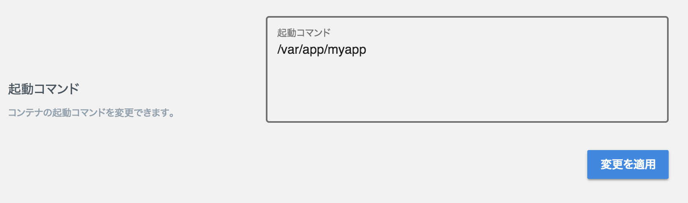

# Todo-Backend API server written in Go for "LOLIPOP! Managed Cloud"

[Todo-Backend](https://todobackend.com/)のTODOアプリのスペックに対応したバックエンドAPIサーバです。

https://todobackend.com/client/index.html?https://todo-backend-golang-mc.lolipop.io/todos

[ロリポップ！マネージドクラウド](https://mc.lolipop.jp)のGoプロジェクトに、**たった2コマンドで**デプロイ可能です。

## 事前準備

- [ロリポップ！マネージドクラウド](https://mc.lolipop.jp)で新規Goプロジェクトを作成します。
- [SSH公開鍵](https://mc.lolipop.jp/console/sshkeys)の設定を済ませてください( [ヘルプ](https://mclolipop.zendesk.com/hc/ja/articles/360001057808-%E5%85%AC%E9%96%8B%E9%8D%B5%E3%81%AE%E4%BD%9C%E6%88%90-%E7%99%BB%E9%8C%B2%E6%96%B9%E6%B3%95) )。
    - Windowsの環境ヘルプは[こちら](docs/HOW_TO_SETUP_WINDOWS_ENVIRONMENT.md)

### SSHの接続テスト

作成したGoプロジェクトのプロジェクト画面に表示されている `SSHコマンド` でログインできることを確認してください。

以下が表示されたらテストOKです。

```
Last login: Thu Nov 15 02:40:59 2018 from 10.1.12.1
  __  __  ____   _          _ _
 |  \/  |/ ___| | |    ___ | (_)_ __   ___  _ __
 | |\/| | |     | |   / _ \| | | '_ \ / _ \| '_ \
 | |  | | |___ _| |__| (_) | | | |_) | (_) | |_) |
 |_|  |_|\____(_)_____\___/|_|_| .__/ \___/| .__/
                               |_|         |_|

******* Welcome to Lolipop! Managed Cloud *******
```

### Makefileの設定を変更

プロジェクト画面に表示されている各情報をもとにMakefileを修正します（`make`実行時に渡す形でも構いません）

| マネージドクラウド | Makefile |
| --- | --- |
| SSH/SFTP ホスト名 | SSH_HOST ?= [ここに記載] |
| SSH/SFTP ポート | SSH_PORT ?= [ここに記載] |
| SSH/SFTP ユーザー名 | SSH_USER ?= [ここに記載] |
| データベース データベース名 | DB_NAME ?= [ここに記載] |
| データベース ユーザー名 | DB_USER ?= [ここに記載] |
| データベース パスワード | DB_PASS ?= [ここに記載] |
| データベース データベースのホスト名 | DB_HOST ?= [ここに記載] |

## デプロイ方法

1. データベースの初期化
2. バックエンドAPIサーバをデプロイ
3. 起動コマンドの設定（マネージドクラウドのダッシュボード）

で完了します。

### 1. データベースの初期化

``` console
$ make initdb
```

### 2. デプロイ

``` console
$ make deploy
```

### 3. 起動コマンドを設定

起動コマンドを `/var/app/current/server` に設定します



プロジェクトURLにアクセスして画面が表示されれば成功です。

## 動作確認方法

### フロントサイド(Todo-Backend)と繋いで表示してみましょう
`https://todobackend.com/client/index.html?[プロジェクトURL]/todos` にアクセスして動作を確認できます。

(ex. https://todobackend.com/client/index.html?https://todo-backend-golang-mc.lolipop.io/todos )

あるいは、[https://todobackend.com/client/](https://todobackend.com/client/)に `[プロジェクトURL]/todos` を入力しても良いです

### 直接cURLでリクエストしてみよう

コマンドラインから

```console
$ export PROJECT_DOMAIN="プロジェクトURL"
```

一覧を表示
```console
$ curl https://$PROJECT_DOMAIN/todos
[{"title":"マネージドクラウドに登録する","completed":false,"order":1,"url":"https://polished-miyakonojo-8226.lolipop.io/todos/1"},{"title":"マネージドクラウドでGoアプリケーションをデプロイする","completed":false,"order":2,"url":"https://polished-miyakonojo-8226.lolipop.io/todos/2"}]
```

作成
```console
$ curl -X POST -d '{"title":"curlから登録してみる","completed":false, "order":3}}' https://$PROJECT_DOMAIN/todos
{"title":"curlから登録してみる","completed":false,"order":3,"url":"https://polished-miyakonojo-8226.lolipop.io/todos/3"}
```

更新
```console
$ curl -X PATCH -d '{"completed":true}' https://$PROJECT_DOMAIN/todos/3
{"title":"curlから登録してみる","completed":true,"order":3,"url":"https://polished-miyakonojo-8226.lolipop.io/todos/3"}
```

削除
```console
$ curl -X DELETE https://$PROJECT_DOMAIN/todos/3
$ curl https://$PROJECT_DOMAIN/todos
[{"title":"マネージドクラウドに登録する","completed":false,"order":1,"url":"https://polished-miyakonojo-8226.lolipop.io/todos/1"},{"title":"マネージドクラウドでGoアプリケーションをデプロイする","completed":false,"order":2,"url":"https://polished-miyakonojo-8226.lolipop.io/todos/2"}]
```

## ローカルでの開発環境の用意

Dockerがあれば、ローカルでの開発環境を簡単に用意できます

まず、テンポラリなMySQLサーバを起動します。起動と同時にデータベースとテーブルが作成されます。

``` console
$ make dev-start
```

APIサーバをビルドして起動します

``` console
$ make server
```

開発が終了したらMySQLサーバを消します

``` console
$ make dev-stop
```

## 開発時に便利なコマンド

## ビルド方法

``` console
$ make build
```

## マネージドクラウドに保存されているログの確認

マネージドクラウドはWebコンテナのSTDOUTとSTDERRを`/var/log/container/*/haconiwa.out` `/var/log/container/*/haconiwa.err` に保存しています。

以下のコマンドでそれぞれのログを時系列にローカルのSTDOUTに表示します

``` console
$ make logs-out
```

``` console
$ make logs-err
```

## 各ディレクトリ/ファイルの一口解説

- `initdb.sql`
  - データベースのスキーマ定義と、初期のデータ
- `Makefile`
  - ビルドやデプロイの手続きをまとめたMakefile. 使い方は上記READMEを参照のこと
- `main.go`
  - プログラムの開始地点(`main()` 関数)と、サーバ起動・ルーティングなどの主な処理。
- `todo.go`
  - todosテーブルのビジネスロジックを記述したコード (所謂モデルというものです)
- `go.mod`
  - vgoというパッケージ管理ツールの生成するファイル. (ruyにおけるGemfile、npmにおけるpackage.jsonみたいなもの)
- `go.sum`
  - こちらもvgoが生成するファイル
- `templates/`
  - `html/template` パッケージで利用するテンプレートファイル
- `assets/`
  - cssや画像ファイルなど. ファイル配信のサンプルで利用
- `docs/`
  - Windowsの方向けの設定方法です!

## 利用している主なパッケージ

- [go-chi](https://github.com/go-chi/chi)
  - シンプルなルーティング機能を提供してくれるパッケージ
- [sqlx](https://github.com/jmoiron/sqlx)
  - Goの標準sqlパッケージを拡張するパッケージ
  - Selectの結果をStructにマッピングしてくれる機能など
- [godotenv](https://github.com/joho/godotenv)
  - `.env`ファイルから環境変数を読み出す機能を持つパッケージ
  - データベース名、パスワードをアプリケーションに渡すために利用

## References

- https://github.com/mforman/todo-backend-golang
