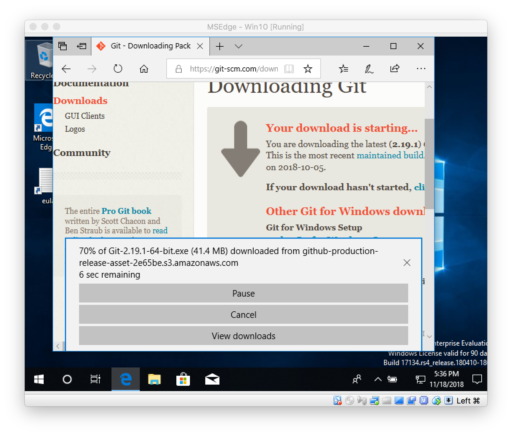
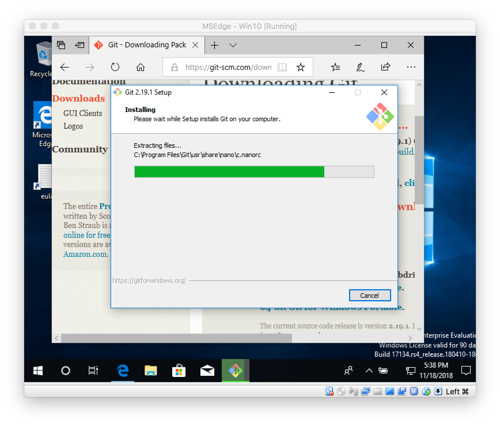
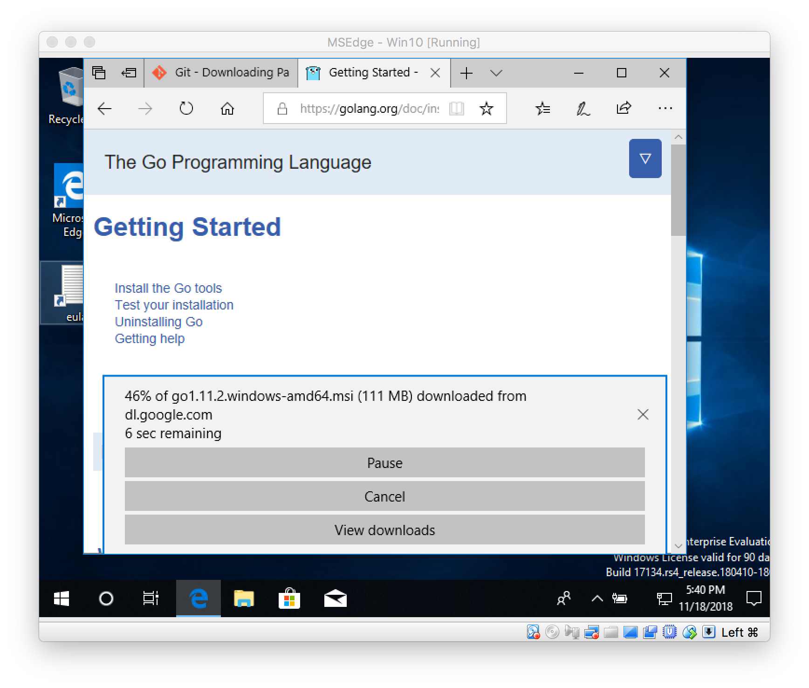
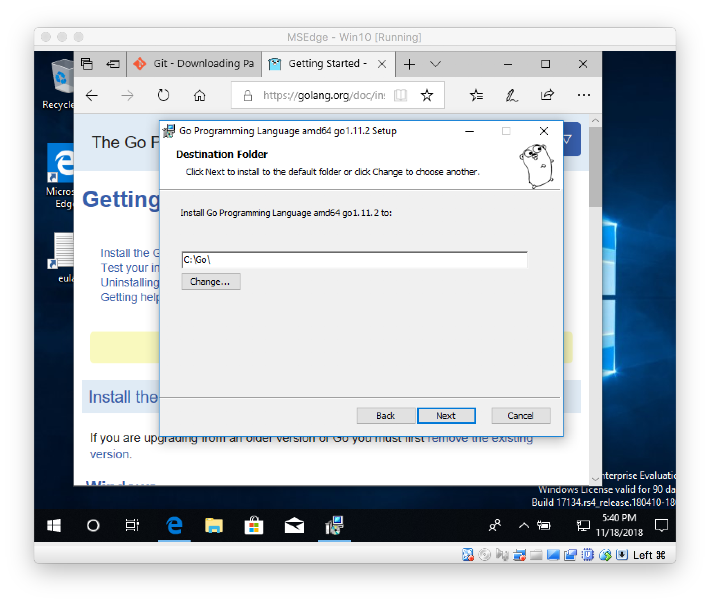
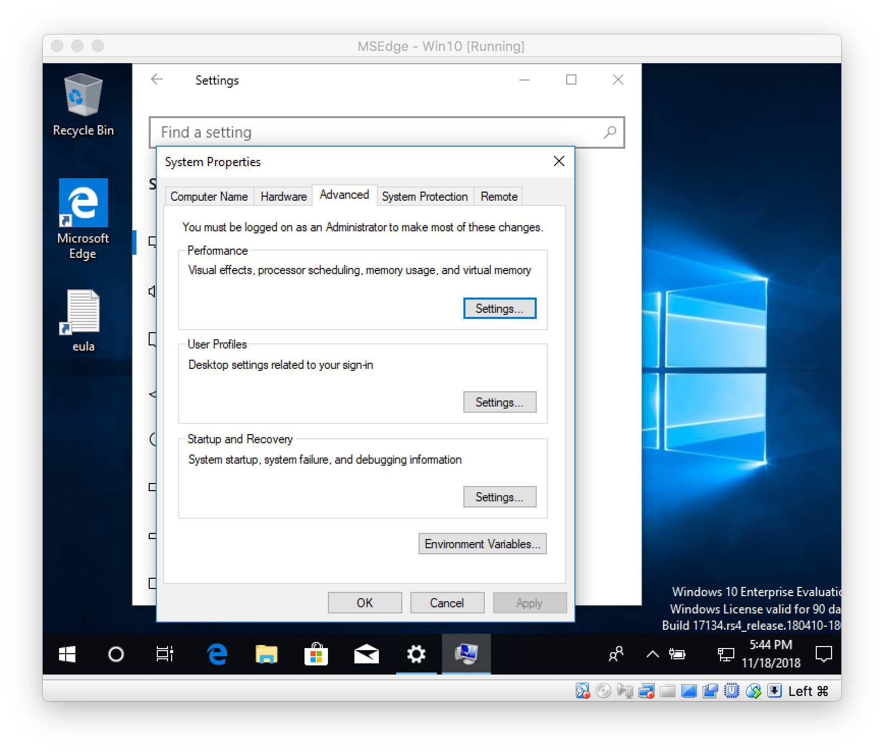
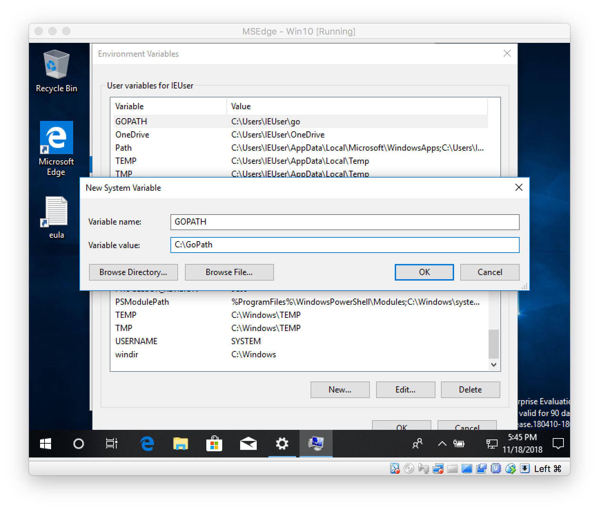
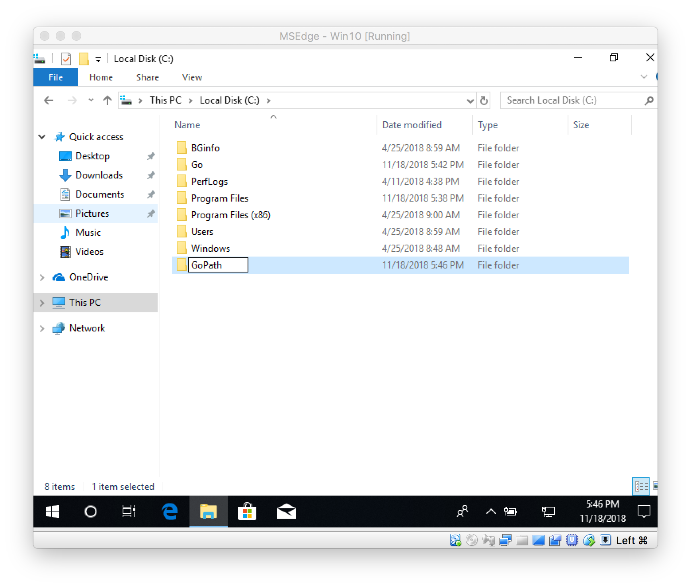
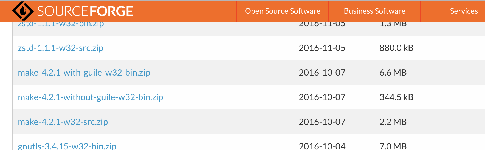
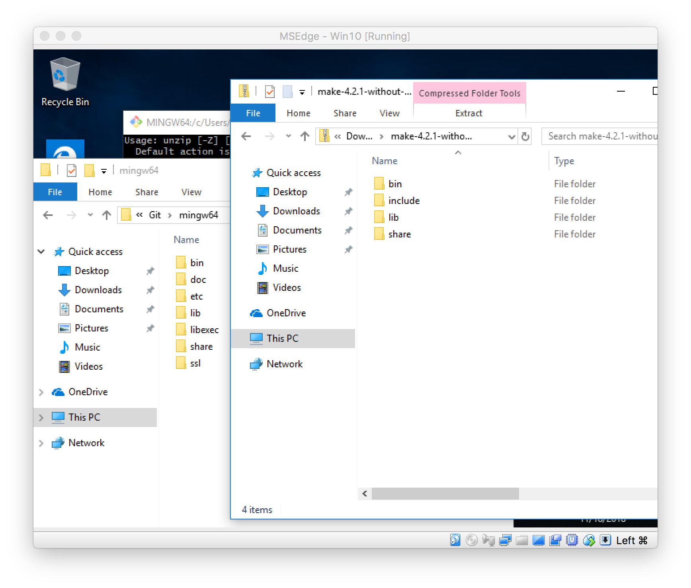
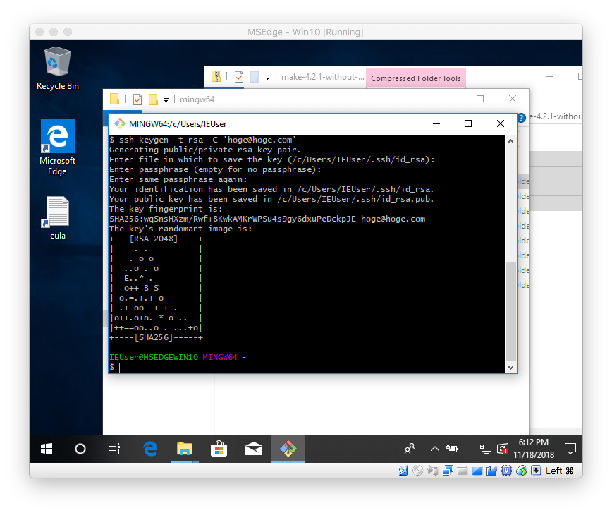

# Windows環境のセットアップ

WindowsでSSH/SCP/Go/Git/Makeが利用できる環境を整備します。

## インストールするもの

- [Git](https://git-scm.com/download/win)
    - 同時に`Git Bash` と呼ばれるBash環境がインストールされるので、こちらに環境を整備します。
- [Go](https://golang.org/dl/)
- [Make](https://sourceforge.net/projects/ezwinports/files/)

## Gitのインストール

GitのオフィシャルサイトからWindows用Gitをダウンロードします。

実行ファイルをクリックしてGitをインストールします。ウィザード画面の設定はそのままで問題ありません。

## Goのインストール

まずGoのオフィシャルサイトからWindows用Goをダウンロードします。

実行ファイルをクリックしてGoをインストールします。ウィザード画面の設定はそのままで問題ありません。

### $GOPATHの設定

Goに必要な `GOPATH` という環境変数を設定します。

システムの環境変数設定画面を開きます。

システムの環境変数に `GOPATH` を `C:\GoPath` として設定します。

また `C:\GoPath` ディレクトリを作成します。

## Makeのインストール

Makeをダウンロードします。

解凍したファイルを、`C:\Program Files\Git\mingw64\` にコピーします。ファイルの上書きになる場合は **上書きをしないようにしてください**

## SSH公開鍵/秘密鍵の作成

`Git Bash` を起動します。

[マネージドクラウドヘルプのMac編](https://mclolipop.zendesk.com/hc/ja/articles/360001057808-%E5%85%AC%E9%96%8B%E9%8D%B5%E3%81%AE%E4%BD%9C%E6%88%90-%E7%99%BB%E9%8C%B2%E6%96%B9%E6%B3%95)と同様に公開鍵/秘密鍵を作成します。

マネージドクラウドへの登録も[ヘルプ](https://mclolipop.zendesk.com/hc/ja/articles/360001057808-%E5%85%AC%E9%96%8B%E9%8D%B5%E3%81%AE%E4%BD%9C%E6%88%90-%E7%99%BB%E9%8C%B2%E6%96%B9%E6%B3%95)をみて実施してください。

## README.mdの作業

[README.md](../README.md)の作業は`Git Bash`を利用してください。Makefileやソースコードの編集は、好きなエディタで行って構いません。
